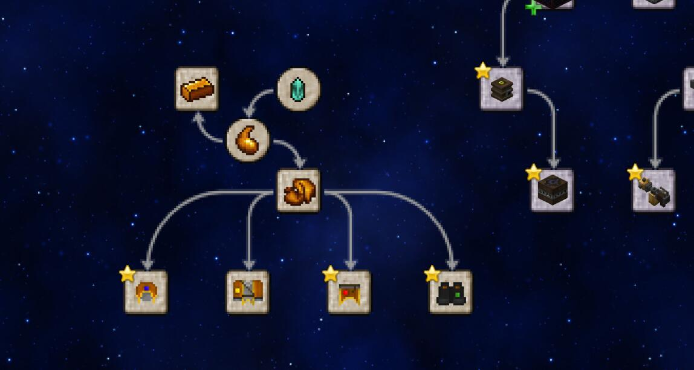

# Keletu's Pack Mod

 

WARNING: THE ENGLISH TRANSLATION MAY NOT BE SO ACCURATE

## 下载 (DOWNLOAD)
由于现在是开发阶段，下载请从action中的build中下载。如果有错误欢迎提交issue

(Since it's now in Dev version, please download it from the actual build. If there're any errors, please submit an issue)

## dev to-do

1. [√] 删除灵液桶 (Remove Ichor Bucket)
2. - [ ] 添加云霄塔法袍3D效果 (Add a 3D effect to Robes of the Stratosphere)
3. - [ ] 添加魔导手册文案 (Add a Thaumonomicon copy/Add Thaumonomicon Entries (I didn't get what is really being said here))
4. [√] 添加法袍抵挡弹射物效果 (Add Projectile Protection to Robes)
5. - [ ] 添加护腿发光效果 (Add leggings a Glow effect)
6. [√] 添加靴子绿化效果 (Add a effect to grow grass for Boots)
7. - [ ] 添加工具觉醒效果 (Add a Awakening effect for Tools)
8. - [ ] 更改包名 (Change mod's name)

## 依赖 (Dependencies)

本模组依赖于 神秘时代6（This mod requires Thaumcraft 6）

## 添加 (Additions)

### 任务 (Research)

### 物品 (Items)

1. 灵液块 (Ichor Block)
2. 腐化肉块 (Taint Meat)
3. 灵宝剑 (Ichorium Sword)
4. 灵宝斧 (Ichorium Axe)
5. 灵宝铲 (Ichorium Shovel)
6. 灵宝镐 (Ichorium Pickaxe)
7. 灵宝头巾 (Ichorium Cowl)
8. 灵宝法袍 (Ichorcloth Robe)
9. 灵宝护腿 (Ichorcloth Leggings)
10. 灵宝靴子 (Ichorcloth Boots)
11. 无尽深渊之帽子 (Cowl of the Abyssal Depths)
12. 云霄塔法袍 (Robes of the Stratosphere)
13. 熔岩地幔护腿 (Leggings of the Burning Mantle)
14. 地平线盾牌之靴 (Boots of the Horizon Shield)
15. 奥术石蕊试纸 (Arcane Litmus Paper)
16. 巫师币 (Wizard's Coin)
17. 探险家币 (Adventure's Coin)
18. 血渍斑斑的金币 (Bloodstained Coin)
19. 魔法使币 (Magic Coin)
20. 末影裂痕 (Ender Fragment)
21. 下界残片 (Nether Fragment)
22. 灵液 (Ichor)
23. 灵布 (Ichor Cloth)
24. 灵宝 (Ichorium Ingot)
25. 扭曲清除坠饰 (Warp Cleaning Charm)
26. 糖渍地狱疣 (Nether Swart)
27. 地狱疣蛋糕 (Nether Cake)
