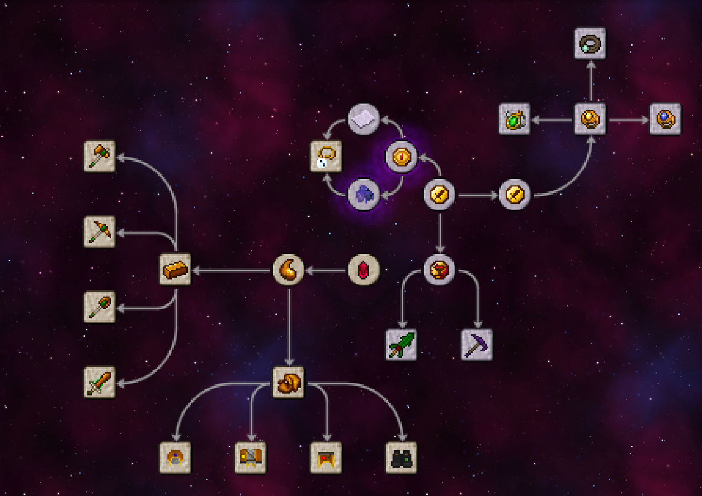

# 神秘杂项 (Thaumisc)

 

## 语言 Language
> 请自行维护自己所需的语言，各语言由于翻译问题可能不会同步。

- [中文简体](./README.md)
- [English](./doc/en_us/README.md)
- [Português](./doc/pt_br/README.md)

## 下载 (DOWNLOAD)
由于现在是开发阶段，下载请从action中的build中下载。如果有错误欢迎提交issue

(Since it's now in Dev version, please download it from the actual build. If there're any errors, please submit an issue)

## dev to-do

1. - [x] 删除灵液桶 (Remove Ichor Bucket)
2. - [x] 添加云霄塔法袍3D效果 (Add a 3D effect to Robes of the Stratosphere)
3. - [x] 添加魔导手册文案 (Add Thaumonomicon Entries)
4. - [x] 添加法袍抵挡弹射物效果 (Add Projectile Protection to Robes)
5. - [x] 添加护腿发光效果 (Add leggings a Glow effect)
6. - [x] 添加靴子绿化效果 (Add an effect to grow grass for Boots)
7. - [x] 添加工具觉醒效果 (Add the Awakening Tools)
8. - [x] 更改包名 (Change mod's name)
9. - [x] 把英文扔到专门的readme去 (Create an english version for the README.md file)
10. - [x] 觉醒灵宝斧和剑 (Add the Awakening Axe and Awakening Sword)
11. - [x] 基岩世界矿物产量调整 (Adjustments for ore generation in The Bedrock World)
12. - [x] 下界残片，末影裂痕的所含要素 (Increase the Aspects contained in the Nether Shard and Ender Shard)
13. - [x] 神秘领域与神秘奇境的联动：晶化腐肉，击败腐化之尸掉落，可以用来更好的制作精金与秘金材料 (When this mod is installed with Thaumic Additions: Reconstructed and Thaumic Wonders, defeating Avatar of Corruption will drop Rotten Essence Flesh, which can be used to better craft Mithminite and Adaminite materials)

## 依赖 (Dependencies)

本模组依赖于 神秘时代6（This mod requires Thaumcraft 6）

## 添加 (Additions)

### 任务 (Research)

### 物品 (Items)

01. 灵液块 (Ichor Block)
02. 腐化肉块 (Tainted Amalgam)
03. 灵宝剑 (Ichorium Sword)
04. 灵宝斧 (Ichorium Axe)
05. 灵宝铲 (Ichorium Shovel)
06. 灵宝镐 (Ichorium Pickaxe)
07. 灵宝头巾 (Ichorcloth Cowl)
08. 灵宝法袍 (Ichorcloth Robe)
09. 灵宝护腿 (Ichorcloth Leggings)
10. 灵宝靴子 (Ichorcloth Boots)
11. 无尽深渊之帽 (Cowl of the Abyssal Depths)
12. 云霄塔法袍 (Robes of the Stratosphere)
13. 熔岩地幔护腿 (Leggings of the Burning Mantle)
14. 地平线盾牌之靴 (Boots of the Horizontal Shield)
15. 奥术石蕊试纸 (Arcane Litmus Paper)
16. 巫师币 (Wizard's Coin)
17. 探险家币 (Adventure's Coin)
18. 血渍斑斑的金币 (Bloodstained Coin)
19. 魔法使币 (Magic Coin)
20. 末影裂痕 (Ender Shard)
21. 下界残片 (Nether Shard)
22. 灵液 (Ichor)
23. 灵布 (Ichor Cloth)
24. 灵宝 (Ichorium Ingot)
25. 灵宝粒 (Ichorium Nugget)
26. 扭曲清除坠饰 (Cleansing Amulet)
27. 糖渍地狱疣 (Nether Swart)
28. 地狱疣蛋糕 (Nether Cake)
29. 觉醒灵宝镐 (Awakened Ichorium Pickaxe)
30. 觉醒灵宝铲 (Awakened Ichorium Shovel)
31. 觉醒灵宝斧 (Awakened Ichorium Axe)
32. 觉醒灵宝剑 (Awakened Ichorium Sword)
33. 避役镐 (Chamelic Pickaxe)
34. 避役剑 (Chamelic Sword)
35. 避役铲 (Chamelic Shovel)
36. 避役斧 (Chamelic Axe)
37. 畸变镐 (Distortion Pickaxe)
38. 马鞭 (Riding Crop)
39. 符文护盾戒指 (Runic Ring)
40. 符文护盾护身符 (Runic Amulet)
41. 符文护盾腰带 (Runic Girdle)
42. 再充能符文护盾戒指 (Runic Ring of Recovery)
43. 应急符文护盾护身符 (Runic Amulet of Barriers)
44. 冲击符文护盾腰带 (Runic Girdle of Kinesis)
45. 无底袋（未完成）(Ichorcloth Pouch) (unfinished)
46. 基岩世界传送门 (Bedrock Portal)
47. 觉醒灵宝剑 (Thaumic Disassembler)
48. 暗影要塞兜鍪 (Shadow Fortress Helm)
49. 暗影要塞胸铠 (Shadow Fortress Chest)
50. 暗影要塞护腿 (Shadow Fortress Legs)
51. 暗影锭 (Shadow Metal Ingot)
52. 暗影粒 (Shadow Metal Nugget)
53. 暗影金属剑 (Shadow Metal Sword)
54. 暗影金属镐 (Shadow Metal Pickaxe)
55. 暗影金属斧 (Shadow Metal Axe)
56. 暗影金属铲 (Shadow Metal Shovel)
57. 暗影金属锄 (Shadow Metal Hoe)
58. 天域花 (Ethereal Bloom)
59. 水晶奖励袋 (Crystal Treasure Bag (requires Thaumic Additions: Reconstructed))
60. 水晶镶嵌宇宙中子素法师护手 (Crystal Studded Cosmic Neutronium Caster's Gauntlet (requires Avaritia))
61. 极元始珍珠 (Extremely Primordial Pearl (requires Avaritia))
62. 阿卡西记录 (Akashic Record (requires Avaritia))
63. 法杖残片 (Broken Twilight Wand)
64. 损坏的弓 (Broken Twilight Bow)
65. 暮色传送门水晶 (Twilight Portal Crystal)

### 维度 (Dimensions)

基岩世界：一个充满基岩与矿物的世界，可以通过觉醒灵宝镐敲击世界最底层的基岩进入！内部的基岩只有觉醒灵宝镐才能挖掘。

(The Bedrock World: A world full of Bedrock and Minerals, accessible only by left-clicking the lowest bedrock layer in Overworld with a Awakened Ichorium Pickaxe! Only the Awakened Ichorium Pickaxe can mine bedrock in that dimension.)
