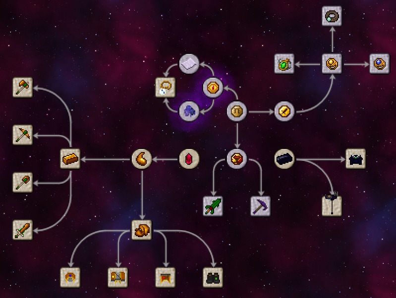

# Thaumisc

 

WARNING: THE ENGLISH TRANSLATION MAY NOT BE SO ACCURATE

## Language
> Please maintain your own desired language, each language may not be synchronized due to translation issues.

- [中文简体](./README.md)
- [English](./doc/en_us/README.md)

## DOWNLOAD

Since it's now in Dev version, please download it from the actual build. If there're any errors, please submit an issue

## dev to-do

1. - [x] Remove Ichor Bucket
2. - [x] Add a 3D effect to Robes of the Stratosphere
3. - [x] Add Thaumonomicon Entries
4. - [x] Add Projectile Protection to Robes
5. - [x] Add leggings a Glow effect
6. - [x] Add an effect to grow grass for Boots
7. - [x] Add the Awakening Tools
8. - [x] Change mod's name
9. - [x] Create an english version for the README.md file
10. - [x] Add the Awakening Axe and Awakening Sword
11. - [x] Adjustments for ore generation in The Bedrock World
12. - [x] Increase the Aspects contained in the Nether Shard and Ender Shard
13. - [x] When this mod is installed with Thaumic Additions: Reconstructed and Thaumic Wonders, defeating Avatar of Corruption will drop Rotten Essence Flesh, which can be used to better craft Mithminite and Adaminite materials.

## Dependencies

This mod requires Thaumcraft 6

## Additions

### Research

### Items

01. Ichor Block
02. Taint Meat
03. Ichorium Sword
04. Ichorium Axe
05. Ichorium Shovel
06. Ichorium Pickaxe
07. Ichorcloth Cowl
08. Ichorcloth Robe
09. Ichorcloth Leggings
10. Ichorcloth Boots
11. Cowl of the Abyssal Depths
12. Robes of the Stratosphere
13. Leggings of the Burning Mantle
14. Boots of the Horizon Shield
15. Arcane Litmus Paper
16. Wizard's Coin
17. Adventure's Coin
18. Bloodstained Coin
19. Magic Coin
20. Ender Shard
21. Nether Shard
22. Ichor
23. Ichor Cloth
24. Ichorium Ingot
25. Ichorium Nugget
26. Cleansing Amulet
27. Nether Swart
28. Nether Cake
29. Awakened Ichorium Pickaxe
30. Awakened Ichorium Shovel
31. Awakened Ichorium Axe
32. Awakened Ichorium Sword
33. Chamelic Pickaxe
34. Chamelic Sword
35. Chamelic Shovel
36. Chamelic Axe
37. Distortion Pickaxe
38. Riding Crop
39. Runic Ring
40. Runic Amulet
41. Runic Girdle
42. Runic Water Ring
43. Runic Earth Amulet
44. Runic Air Girdle
45. Ichorcloth Pouch (unfinished)
46. Bedrock Portal
47. Thaumic Disassembler
48. Shadow Fortress Helm
49. Shadow Fortress Chest
50. Shadow Fortress Legs
51. Shadow Metal Ingot
52. Shadow Metal Nugget
53. Shadow Metal Sword
54. Shadow Metal Pickaxe
55. Shadow Metal Axe
56. Shadow Metal Shovel
57. Shadow Metal Hoe
58. Crystal Treasure Bag (requires Thaumic Additions: Reconstructed)
59. Ethereal Bloom (requires Avaritia)
60. Crystal Studded Cosmic Neutronium Caster's Gauntlet (requires Avaritia)
61. Extremely Primordial Pearl (requires Avaritia)
62. Akashic Record (requires Avaritia)

### Dimensions

The Bedrock World: A world full of Bedrock and Minerals, accessible only by left-clicking the lowest bedrock layer in Overworld with a Awakened Ichorium Pickaxe! Only the Awakened Ichorium Pickaxe can mine bedrock in that dimension.
