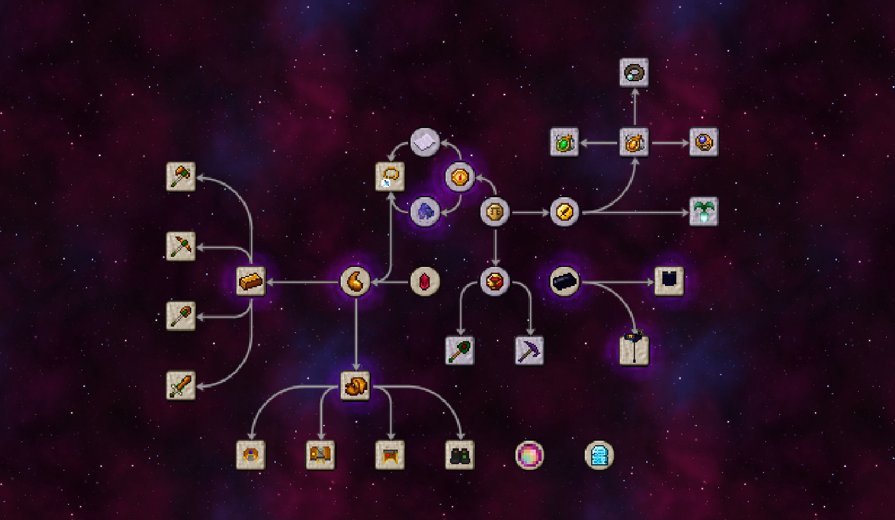

# Thaumisc

 

WARNING: THE ENGLISH TRANSLATION MAY NOT BE SO ACCURATE

## Language
> Please maintain your own desired language, each language may not be synchronized due to translation issues.

- [English](./doc/en_us/README.md)
- [中文简体](../../README.md)

## DOWNLOAD
Since it's now in Dev version, please download it from the actual build. If there're any errors, please submit an issue

## dev to-do

1. - [x] Remove Ichor Bucket
2. - [ ] Add a 3D effect to Robes of the Stratosphere
3. - [ ] Add a Thaumonomicon copy/Add Thaumonomicon Entries (I didn't get what is really being said here)
4. - [x] Add Projectile Protection to Robes
5. - [ ] Add leggings a Glow effect
6. - [x] Add a effect to grow grass for Boots
7. - [ ] Add a Awakening effect for Tools
8. - [ ] Change mod's name
9. - [x] 把英文扔到专门的readme去

## Dependencies

This mod requires Thaumcraft 6

## Additions

### Research

### 物品 (Items)

1. Ichor Block
2. Taint Meat
3. Ichorium Sword
4. Ichorium Axe
5. Ichorium Shovel
6. Ichorium Pickaxe
7. Ichorium Cowl
8. Ichorcloth Robe
9. Ichorcloth Leggings
10. Ichorcloth Boots
11. Cowl of the Abyssal Depths
12. Robes of the Stratosphere
13. Leggings of the Burning Mantle
14. Boots of the Horizon Shield
15. Arcane Litmus Paper
16. Wizard's Coin
17. Adventure's Coin
18. Bloodstained Coin
19. Magic Coin
20. Ender Fragment
21. Nether Fragment
22. Ichor
23. Ichor Cloth
24. Ichorium Ingot
25. Warp Cleaning Charm
26. Nether Swart
27. Nether Cake
