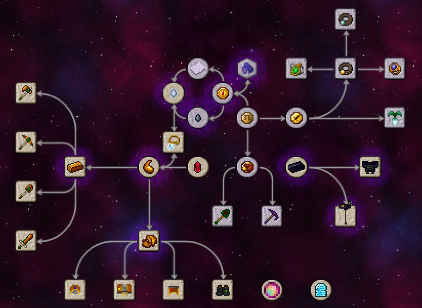

# Thaumisc

 

AVISO: A TRADUÇÃO EM PORTUGUÊS PODE NÂO ESTAR TOTALMENTE CORRETA

## Idioma
> Por favor mantenha-se em seu próprio idioma, cada uma das línguas pode não estar atualizada com as outras por problemas de tradução.

- [中文简体](./README.md)
- [English](./doc/en_us/README.md)
- [Português](./doc/pt_br/README.md)

## DOWNLOAD

Já que o mod está em fase de Desenvolvimento, por favor baixe-o pela fonte original. Se encontrar quaisquer erros, por favor reporte-os

## lista de afazeres do desenvolvedor

1. - [x] Remover o Balde de Icor
2. - [x] Adicionar um efeito 3D para as Vestes da Estratosfera
3. - [x] Adicionar textos ao Thaumonomicon
4. - [x] Adicionar Proteção Contra Projéteis às Vestes
5. - [x] Adicionar às Calças, um efeito de Brilho
6. - [x] Adicionar um efeito de Crescer Grama às Botas
7. - [x] Adicionar as Ferramentas Despertadas
8. - [x] Mudar o nome do mod
9. - [x] Criar uma versão em inglês do arquivo README.md
10. - [x] Adicionar o Machado Despertado e a Espada Despertada
11. - [x] Fazer ajustes na geração de minérios no Mundo Bedrock
12. - [x] Aumentar a quantidade de Aspectos nas Lascas do Nether e nas Lascas do Ender
13. - [x] Quando este mod estiver instalado junto com o Thaumic Additions: Reconstructed e o Thaumic Wonders, ao derrotar o Avatar da Corrupção o fará droppar Carne de Essência Podre, a qual pode ser usada para fazer mais facilmente os materiais de Mithminite e Adaminite.

## Dependências

Este mod requer o Thaumcraft 6

## Adições

### Pesquisas

### Items

01. Bloco de Icor
02. Amálgama de Mácula
03. Espada de Icório
04. Machado de Icório
05. Pá de Icório
06. Picareta de Icório
07. Capuz de Tecido de Icor
08. Vestes de Tecido de Icor
09. Calças de Tecido de Icor
10. Botas de Tecido de Icor
11. Capuz das Profundezas Abissais
12. Vestes da Estratosfera
13. Calças do Manto Ardente
14. Botas do Escudo do Horizonte
15. Papel Tornassol Arcano
16. Moeda de Mago
17. Moeda da Aventura
18. Moeda Ensanguentada
19. Moeda Mágica
20. Lascas do Ender
21. Lascas do Nether
22. Icor
23. Tecido de Icor
24. Barra de Icório
25. Pepita de Icório
26. Amuleto de Remoção
27. Fungo do Nether Fermentado
28. Bolo do Nether
29. Picareta de Icório Despertada
30. Pá de Icório Despertada
31. Machado de Icório Despertado
32. Espada de Icório Despertada
33. Espada Camaleônica
34. Espada Camaleônica
35. Pá Camaleônica
36. Machado Camaleônico
37. Picareta da Distorção
38. Chibata
39. Anel Rúnico
40. Amuleto Rúnico
41. Cinturão Rúnico do Ar
42. Anel Rúnico da Recuperação
43. Amuleto Rúnico das Barreiras
44. Cinturão Rúnico da Cinética
45. Pouxete de Tecido de Icor (inacabada)
46. Portal do Mundo Bedrock
47. Desmontador Taúmico
48. Capacete Fortaleza Sombrio
49. Peitoral Fortaleza Sombrio
50. Calça Fortaleza Sombria
51. Barra de Metal Sombrio
52. Pepita de Metal Sombrio
53. Espada de Metal Sombrio
54. Picareta de Metal Sombrio
55. Machado de Metal Sombrio
56. Pá de Metal Sombrio
57. Enxada de Metal Sombrio
58. Bolsa de Tesouro de Crystal (requer Thaumic Additions: Reconstructed)
59. Flor Etérea (requer Avaritia)
60. Manopla de Neutrônio Cósmico com Adornos Cristalinos (requer Avaritia)
61. Pérola Extremamente Primordial (requer Avaritia)
62. Registro Akáshico (requer Avaritia)
63. Varinha Twilight Quebrada
64. Arco Twilight Quebrado

### Dimensões

O Mundo Bedrock: Um mundo cheio de Bedrock e Minerais, acessível apenas clicando com o botão esquerdo na camada mais baixa de bedrock do Overworld com uma Picareta de Icório Despertada! Apenas a Picareta de Icório Despertada pode minerar bedrock nessa dimensão.
